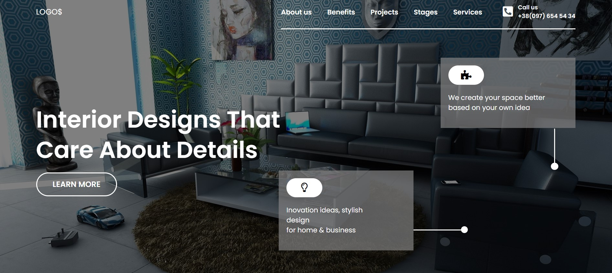
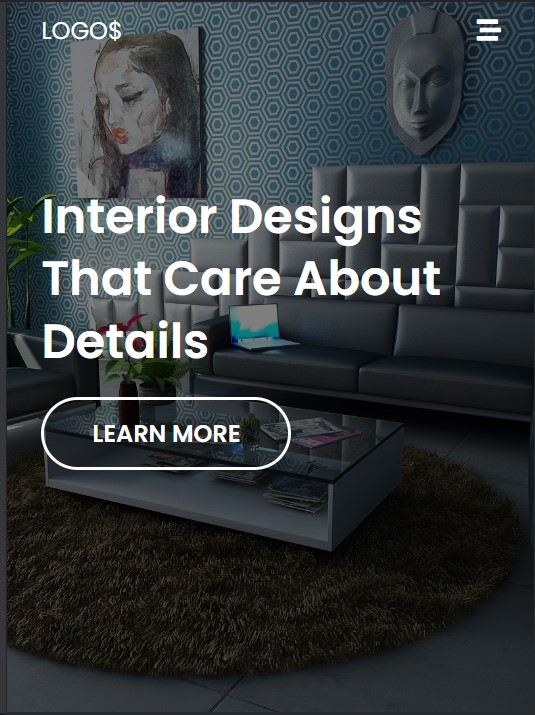

# Web-Designer-Website  

This is a hero page of the a Interior designer website which is completely responsive on every screen.(Desktop, tablet, Mobile)

## 🛠 Technologies Used
---
  - HTML - Hyper Text Markup Language
  - CSS - Cascadeing Spread Sheet
  - CSS - CSS Grid, Flex Box, Positioning

## Deployed Link of the web page
---
[Click to see the webpage](https://idyllic-cendol-7e6275.netlify.app/)

## Author and Contact
---
- [Anurag katiyar](https://github.com/anuragkatiyar1994)
- anuragkatiyar1994@gmail.com 
## Time to finish the project
---

I took around 2 hours to complete this project.
I have learned to use of ::before and ::after pesudo selectors while creating the banner section. 

## Feedback
---

If you have any feedback, please reach out to us at anuragkatiyar1994@gmail.com